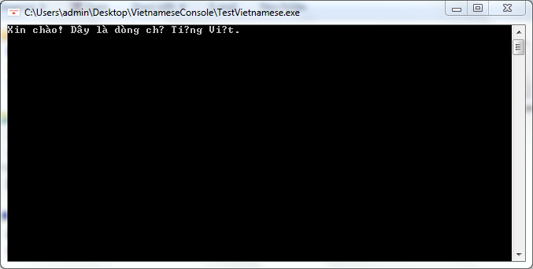
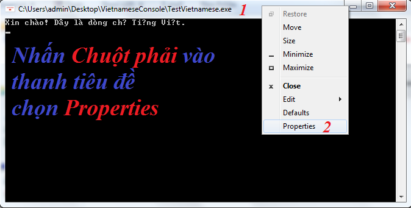
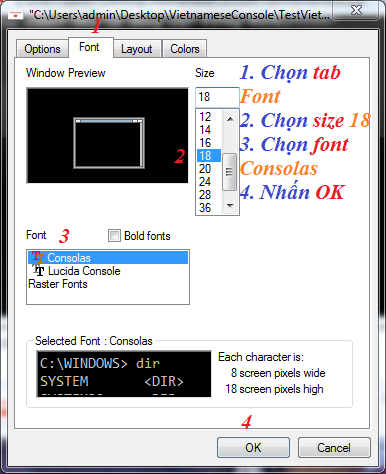
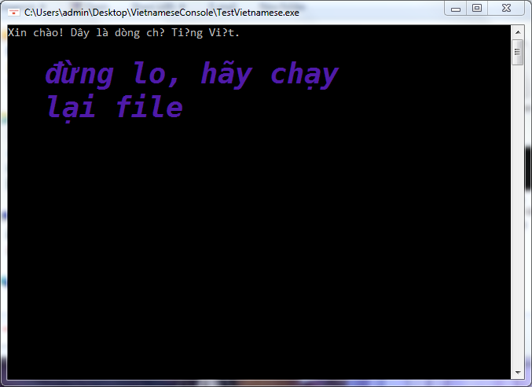
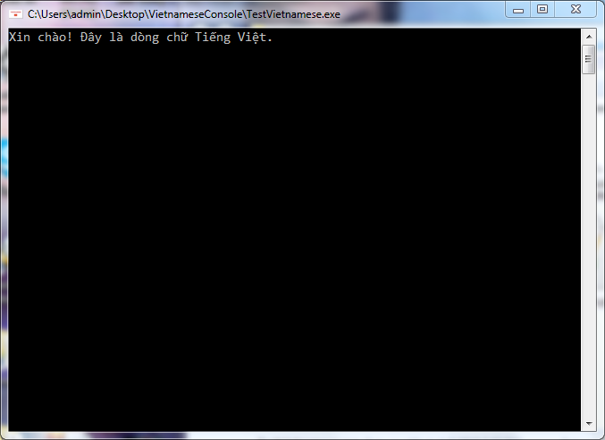

Hướng dẫn hiển thị tiếng việt (thay đổi font)
trên Windows 7 Command prompt

# Hiện trạng:

DEMO.PNG

# Các bước thực hiện:

STEP-1.PNG

STEP-2.PNG

STEP-3.PNG

# Kết quả:

KETQUA.PNG

# Test file:
[TestVietnamese.exe](TestVietnamese.exe)
